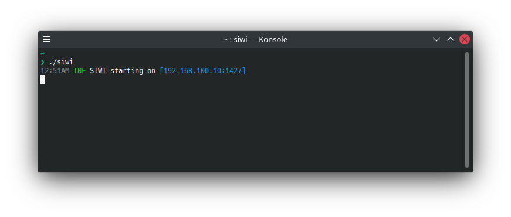
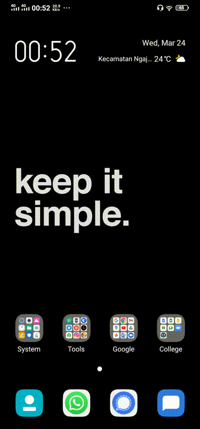
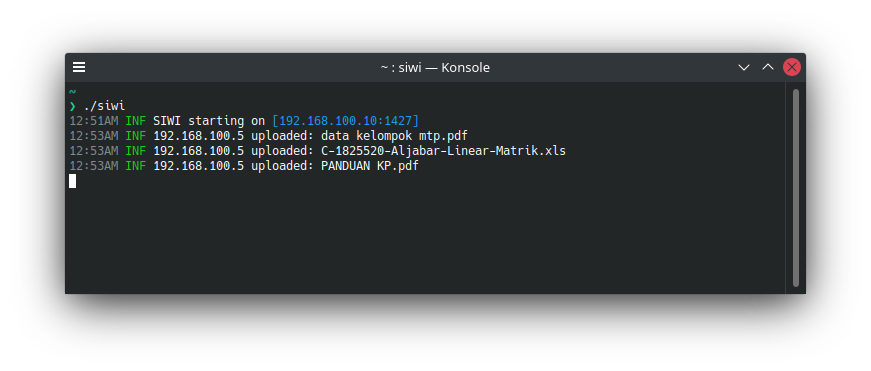

# SIWI (Share In Wired / Wireless Interaction)

`SIWI` is a lightweight application for sharing files multiplatform between devices, building on top of HTTP that running on Linux, Mac, Windows. It's especially good at helping you sharing files without any physical device, uses a web browser for sharing interaction so you don't need to install any application on other devices. Just start one application on PC / Mac and you ready to go :)

## Features

- **Lightweight** - less than 20MB
- **Fast** - running on top of HTTP and compiled into native binary code
- **Multiplatform** - Linux, Mac, Windows and uses browser so other platforms like a smartphone can use too
- **Efficient** - just need to run on one device and another device as a client
- **Concurrent** - when uploading multiple files at once, the files will be processed asynchronously so that there is no need to wait for the file to finish, to upload the next file
- **No external dependencies** - no need additional requirement or depedency
- **Min cost** - uses network wired / wireless to interaction, don't need to buy any physical device for communicating

## Download

Choose your operating system and architecture [here](https://github.com/anonychun/siwi/releases)

## Usage

After downloading the file, extract and go inside `siwi` directory, before you run the program make sure that you connected to a network (no need data or internet access) and finally run the program

_If you only have a PC and smartphone you can turn on the `hotspot` on the smartphone to connect to the PC or you can create `wlan` on PC and connect another device to it as well_

### Windows

Double click `.exe` file to run the program

### Linux or Mac

Open and running program on your terminal

After running the program you will see `siwi` directory automatically created on your `Documents` home directory and inside that we have

- `public`: all files that you put here will be accessible to everyone
- `upload`: where files are uploaded by the client

When application starting you will see a message on your console `INF SIWI starting on [192.168.100.10:1427]` notice that the IP `192.168.100.10:1427` may be different for everyone so make sure you use the IP on your console

To upload files just open client browser and go to given IP address on the application console

When files upload the console will give you information about who is uploading, filename, time, etc

To check files that already uploaded go to your `Documents` home directory on `siwi/upload` and when you wanna share files to the client, put your files into `siwi/public` on the client browser instead of click `UPLOAD` button just click on `PUBLIC` button and you see all files will be shown

## Problem

- When the application cannot start, check your network connection maybe you're not connected to any network
- If you still have a problem create `issues` on this repository so the problem can be fixed
